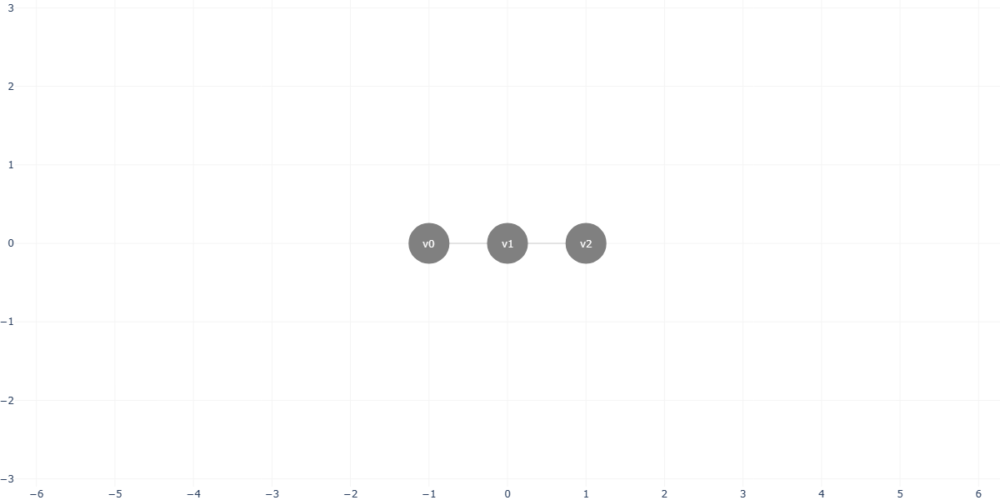
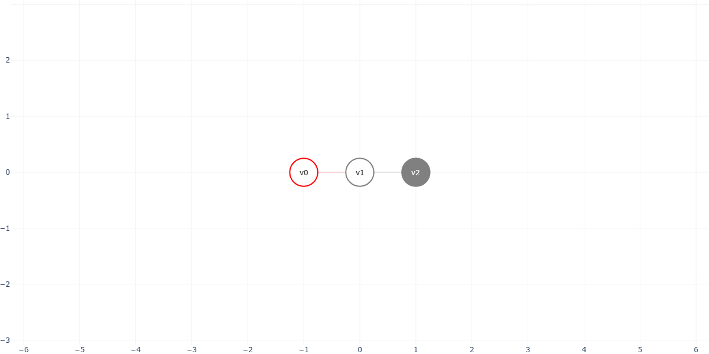
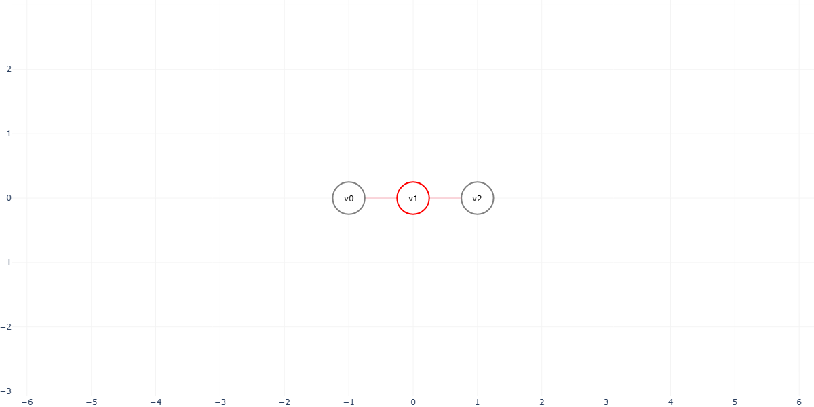

# pylightsout
A Python library for the Lights Out problem

## 1- Importing this library
Download the `.whl` in your project and use:

```
pip install pylightsout-X.Y.Z-py3-none-any.whl
```

> ⚠️ Note that the filename might be different

## 2- Basic usage
After installed, you can create and plot a simple graph using the following:

```Python
from pylightsout import Graph

# Creating an empty graph
G = Graph()

# Adding vertices
v0 = G.add_vertice(coord=(-1, 0))
v1 = G.add_vertice(coord=(0, 0))
v2 = G.add_vertice(coord=(1, 0))

# Adding edges
G.add_edge(v0, v1)
G.add_edge(v1, v2)

# Ploting the graph
G.plot()
```



Press any vertice individually.
```Python
# Pressing a vertice and plotting the result
G.press(v0)
G.plot()
```



You can also use a brute force approach to get all possible solutions for the Lights Out problem.
```Python
# Finding all the possible solutions for the graph
S = G.solve(method='brute_force')

# Printing the result
print(S)

# Plotting the solution
G.plot(X=S[0])
```

> [['v1']]



## 3- Contributing to this library
>⚠️ This part is opitional. You don't need this to use the library in your project!

If you want to contribute to this library, you can clone this repository and build it as you like.

First, clone this repository using:
```
git clone https://github.com/WillianSentoSe/pylightsout
```

Open the project folder and create a Python Virtual Environment (venv) at it's root:

```
python -m venv venv
```
Activate the environment using:
```
source venv/Scripts/activate
```

Then, install the project and build dependencies
```
pip install plotly
pip install wheel
```

After making your changes, use the following to build the library:
```
python setup.py bdist_wheel
```

The new `.whl` file will be created in the **/dist** folder inside the project's root.
