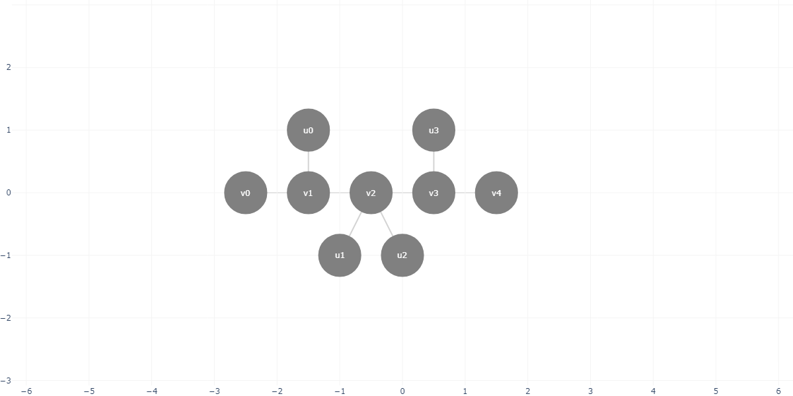

# pylightsout
A Python library for the Lights Out problem

## 1- Importing this library
Download the `.whl` in your project and use:

```
pip install pylightsout-X.Y.Z-py3-none-any.whl
```

## 2- Basic usage
After installed, you can create and plot a simple graph using the following:

```Python
from pylightsout import Graph

# Creating an empty graph
G = Graph()

# Adding vertices
v0 = G.add_vertice(coord=(-1, 0))
v1 = G.add_vertice(coord=(0, 0))
v2 = G.add_vertice(coord=(1, 0))

# Adding edges
G.add_edge(v0, v1)
G.add_edge(v1, v2)

# Ploting the graph
G.plot()
```


Press any vertice individually.
```Python
# Pressing a vertice and plotting the result
G.press(v0)
G.plot()
```


You can also use a brute force approach to get all possible solutions for the Lights Out problem.
```Python
# Finding all the possible solutions for the graph
S = G.solve(method='brute_force')

# Printing the result
print(S)

# Plotting the solution
G.plot(X=S[0])
```

> [['v1']]


## 3- Working with graph classes

### Caterpillar Graph

Create any Caterpillar Graph using the number of legs of each vertice in the main path (spine).

| Property | Type | Required | Description |
| -------- | ---- | -------- | ----------- |
| legs_pattern | List of integers | True | Determines the shape of the graph. Each element represents the number of legs of a vertice of the spine. |
| spine_prefix | String | False | Determines the name prefix of the vertices in the spine. |
| legs_prefix | String | False | Determines the name prefix of the legs vertices. |

```Python
from pylightsout.graph.classes import Caterpillar

G = Caterpillar(legs_pattern=[0, 1, 2, 1, 0])
G.plot()
```


## 4- Contributing to this library (optional)

If you want to contribute to this library, you can clone this repository and build it as you like.

First, clone this repository using:
```bash
git clone https://github.com/WillianSentoSe/pylightsout
```

Open the project folder and create a Python Virtual Environment (venv) at it's root:

```bash
python -m venv venv
```
Activate the environment using:

```bash
source venv/Scripts/activate
```

Then, install the project and build dependencies

```bash
pip install plotly
pip install wheel
```

After making your changes, use the following to build the library:

```bash
python setup.py bdist_wheel
```

The new `.whl` file will be created in the **/dist** folder inside the project's root.
